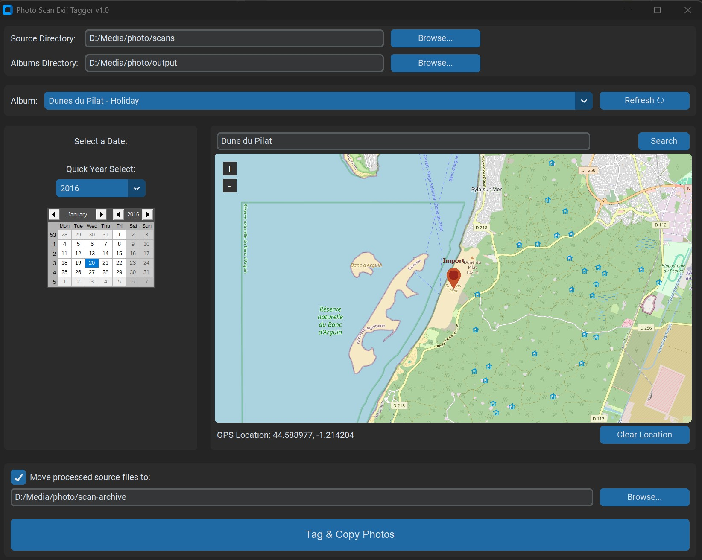

# Photo Scan Exif Tagger

A simple Python UI application designed to **batch-add** "Date" and "GPS Location" EXIF tags to old photos, such as scanned images, and copy them into an existing album structure.

This tool is perfect for integrating scanned family photos into photo management software like **Digikam**.



## Features

* **Process Photos in Batches:** Apply a single date and location to an entire folder of photos at once (e.g., a full roll of film or a set of scans from one event).
* Select a source directory (of your scanned photos) and a target "Albums" directory.
* Automatically lists all sub-folders in your "Albums" directory as a dropdown.
* Select a "Date Taken" using a calendar with a fast "Quick Year Select" dropdown (1900-Present).
* Select a GPS location by searching for a city name or by right-clicking on an OpenStreetMap.
* Writes the selected date to the **EXIF `DateTimeOriginal`** (Date Taken) and **`DateTimeDigitized`** tags.
* Writes the selected location to the **EXIF GPS** tags (if a location is set).
* Copies the newly tagged photos into the selected album folder, leaving your original scans untouched.
* **Optionally move processed source files** to an "archive" folder to clean up your "scans" directory.

---

## Installation

1.  **Get Python:** Make sure you have Python installed on your system. You can download it from [python.org](https://python.org).
2.  **Get the Script:** Save the Python script (e.g., `photo_importer.py`) to a folder on your computer.
3.  **Install Libraries:** Open a terminal or command prompt and install the required libraries using `pip`:

    ```bash
    pip install customtkinter tkcalendar tkintermapview pillow piexif
    ```

---

## How to Use

1.  Run the script from your terminal:

    ```bash
    python photo_importer.py
    ```

2.  **Source Directory:** Browse to the folder containing your scanned `.jpg` photos.
3.  **Albums Directory:** Browse to the **parent** folder that contains all your albums (e.g., `D:\My Pictures\Albums`).
4.  **Album:** Select the destination album from the dropdown. This folder **must already exist** inside your "Albums Directory".
    * Click **Refresh ↻** if you create a new album folder while the app is open.
5.  **Date:** Select the "Date Taken" for the photos using the calendar or the "Quick Year Select" dropdown.
6.  **Location:**
    * Type a city name (e.g., "Paris") and click **Search**. The map will center and set a marker.
    * *Alternatively*, right-click anywhere on the map to set a precise location.
    * Click **Clear Location** if you do not want to add GPS tags.
7.  **(Optional) Archive Files:** Check the "Move processed source files to:" box and browse to a folder where you want your *original scans* to be moved after they are tagged and copied.
8.  **Start Import:** Click the large "Tag & Copy Photos" button. The app will process **all photos in the source folder as a single batch**, adding the selected date/location, copying them, and then moving the originals (if selected).

---

## Using with Digikam (or other Photo Managers)

This tool is designed to work perfectly with any photo management software that reads EXIF metadata.

1.  Set your **"Albums Directory"** in this app to be the same root folder that Digikam scans for photos.
2.  Use this tool to import your scanned photos into the correct album folder (e.g., `Albums\1985 - Family Vacation`).
3.  Open Digikam.
4.  In the album list, right-click the album you just imported to (or the parent folder).
5.  Select **"Refresh"** or **"Rescan for New Items"**.

Digikam will read the newly copied files and automatically detect the **Date Taken** and **GPS Location** from the EXIF tags you just added. Your old scans will now appear correctly on Digikam's timeline and map views.

---

## Troubleshooting

### Map Search Fails (403 Forbidden Error)

If you are using a very new version of Python (like **Python 3.13 or newer**), you may find that the map search fails with a `Status code 403 (Forbidden)` error. This happens because `pip` installs an older, incompatible version of the `tkintermapview` library.

To fix this, you must manually edit one of the library's files:

1.  **Find the file:** Open this file in a text editor (the exact path will depend on your Python installation):

    `.../Lib/site-packages/tkintermapview/tkinter_map_view.py`

2.  **Find the line:** Search for the function `def set_address` (it's often around line 720). Inside that function, find this line:

    ```python
    g = geocoder.osm(address_string)
    ```

3.  **Modify the line:** Add the `headers` argument to identify your app:

    ```python
    g = geocoder.osm(address_string, headers={'User-Agent': 'PhotoImporterApp/1.0'})
    ```

4.  **Save** the file. The map search will now work correctly.
